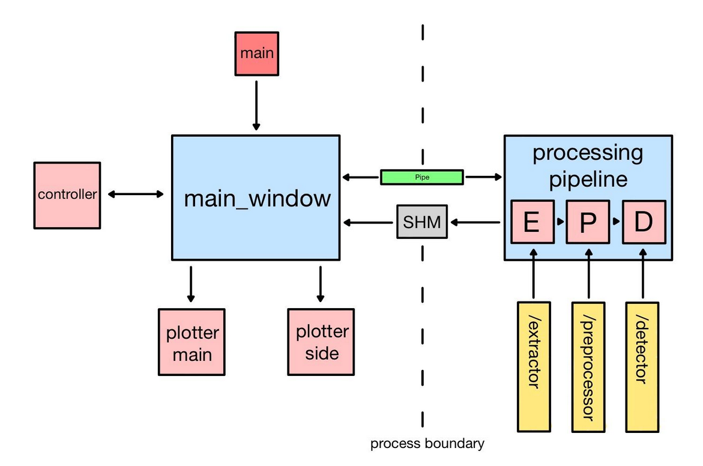

# frem-ecg-detector

A real-time data processing and visualization desktop application built with
a focus on systems design, processing performance and clean architecture.

The pipeline processes ECG data sample-by-sample from the MIT-BIH arrhythmia
dataset, simulating real-time acquisition. It runs bandpass filtering, feature
extraction and heartbeat detection through a look-back mechanism, all decoupled 
from the visualization layer via shared memory and a ring buffer.

This project was developed from a strong personal interest in ECG systems
and software engineering. It reflects my approach to designing systems, emphasizing 
clarity, correctness, and control over the implementation.

## DEMO

## Architecture Design
This project tackles the engineering challenges of real-time data ingestion, processing
and visualization including buffering, process synchronization and low-latency
data transfer using a simulated ECG stream from the MIT-BIH arrhythmia dataset as
the signal source.

The project works with two processes, one spawned automatically by the GUI
and generally handles the Graphic User Interface (GUI)-side of the application, 
and the other is spawned only when the processing pipeline is activated. This 
process separation serves to bypass Python's GIL (Global Interpreter Lock) and 
have the heavier workload in pipeline to be independent of the processes in the 
GUI. Bypassing Python's GIL also means the GUI not having to wait for its turn
to continue its UI functions.

Overall, main_window in the GUI process acts as the organizer for all the different
classes, threads and processes. This division of labour follows the idea
of compartmentalization by isolating each function and centralizing events logic. The three
classes working directly under main_window are controller, plotter_main and plotter_side. 
Controller, evidently, centralizes parts of the GUI with which the user can interact.
The resulting signal is then relayed to main_window and main_window subsequently activates
other logics tied to this signal. Plotter_main plots the incoming signal and its subsequent
derivatives, such as the processed signal, the detector values and the heartbeats detected.
Plotter_side acts as a second plotter that displays mainly statistics to arriving signal.

The processing pipeline is the working pipeline that combines the extractor (E), 
preprocessor (P) and detector (D) and the subsequent transferring of data 
to the GUI process. The three processes E+P+D are plugin-based classes, each with
a base class, that are very straightforward to extend. The plugin-based method
supports the expansion of each process without ever touching the main pipeline.

The GUI and the pipeline are connected using two Interprocess Communication (IPC)
methods, namely Pipe for Status and/or Commands exchange and (versioned) 
Shared Memory (SHM) for data transfer. The choice of using Pipe for commands exchange only
was to avoid backpressure that might occur in the high-frequency communication 
setting between the two processes. SHM, especially with a versioned lock, handles
this well by allowing a non-blocking read, which removes the backpressure risk.
Think of Pipe as a doorbell and SHM as a shared whiteboard.

After the pipeline tells the GUI that data was written in the SHM, an independent
listener thread in the GUI process will extract the new data and inserts them into
a ring buffer in plotter_main. This ring buffer supports the decoupled state of the 
writer and its reader/plotter, which means plotter_main updates its figures independently
of incoming data and this also allows the processing pipeline to be faster than the plotter.

## Roadmap
- Integrate pytest/ GitHub actions
- Show file annotations
- Add settings pop-up for changing the parameters of extractor, preprocessor and detector
- (eventually) Add option to install WFDB files using the library
